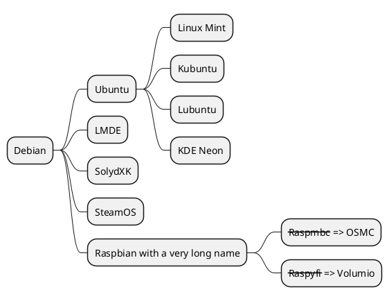
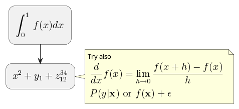
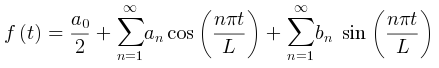

下面是一个简单的UML图
```plantuml
Cat -> Dog : hello
Dog -> Cat : hi
```

下面是一个思维导图

```plantuml
@startmindmap
* Debian
** Ubuntu
*** Linux Mint
*** Kubuntu
*** Lubuntu
*** KDE Neon
** LMDE
** SolydXK
** SteamOS
** Raspbian with a very long name
*** <s>Raspmbc</s> => OSMC
*** <s>Raspyfi</s> => Volumio
@endmindmap
```

下面是一个数学公式

```plantuml
@startuml
:<latex>\int_0^1f(x)dx</latex>;
:<latex>x^2+y_1+z_{12}^{34}</latex>;
note right
Try also
<latex>\dfrac{d}{dx}f(x)=\lim\limits_{h \to 0}\dfrac{f(x+h)-f(x)}{h}</latex>
<latex>P(y|\mathbf{x}) \mbox{ or } f(\mathbf{x})+\epsilon</latex>
end note
@enduml
```

另一个公式

```plantuml
@startmath
f(t)=(a_0)/2 + sum_(n=1)^ooa_ncos((npit)/L)+sum_(n=1)^oo b_n\ sin((npit)/L)
@endmath
```

来自https://plantuml.com/zh/