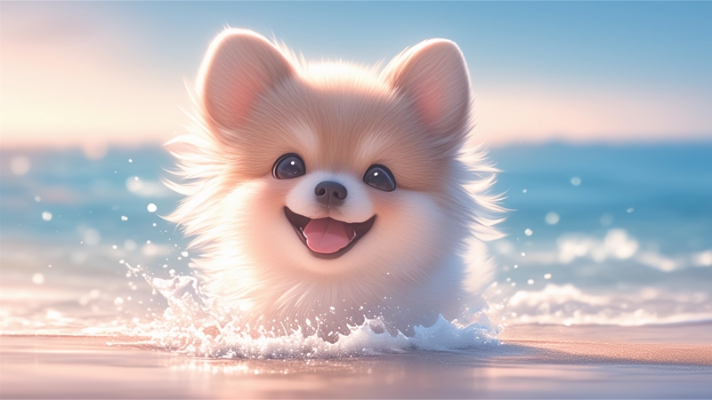

<html lang="en"> 
<head> 
  <meta charset="utf-8">
  <meta name="viewport" content="width=device-width, initial-scale=1"> 
    <title>About</title> 
    
</head>

  

    

      

        
      

      

        <h2>那时我们有梦，</h2>
        <h2>关于文字，关于爱情，</h2>
        <h2>关于穿越世界的旅行。</h2>
      

    

  

  

